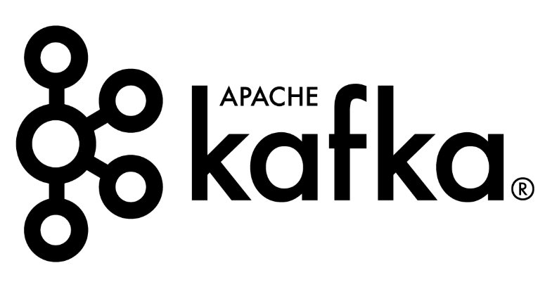
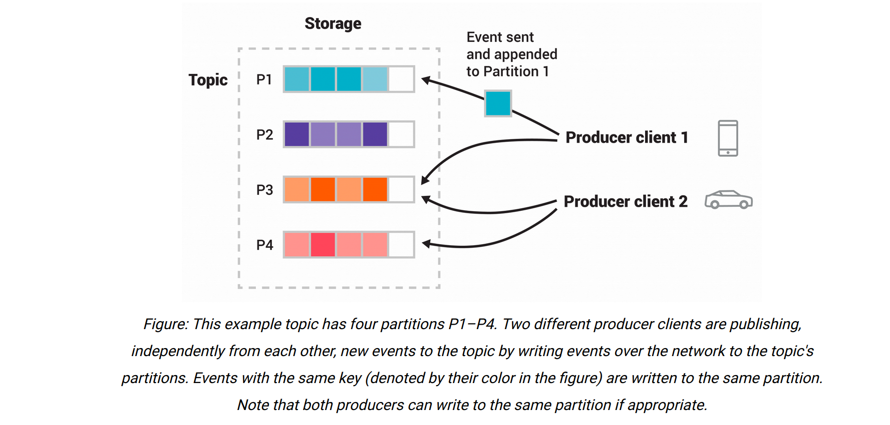
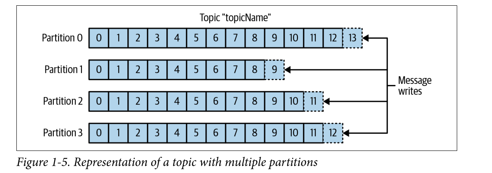

# Apache Kafka

Apache Kafka is a `distributed event store` and `stream-processing platform`. 

It is an open-source system developed by the Apache Software Foundation written in `Java` and `Scala`. 

The project aims to provide a unified, high-throughput, low-latency platform for handling real-time data feeds. 

Kafka can connect to external systems (for data import/export) via Kafka Connect, and provides the Kafka Streams libraries for stream processing applications. 

Kafka uses a `binary TCP-based protocol` that is optimized for efficiency and relies on a "message set" abstraction that naturally groups messages together to reduce the overhead of the network roundtrip. 

This "leads to larger network packets, larger sequential disk operations, contiguous memory blocks [...] which allows Kafka to turn a bursty stream of random message writes into linear writes.

Kafka was originally developed at `LinkedIn`, and was subsequently `open sourced` in early `2011`. 

`Jay Kreps`, `Neha Narkhede` and `Jun Rao` helped co-create Kafka.

Graduation from the Apache Incubator occurred on 23 October 2012. Jay Kreps chose to name the software after the author `Franz Kafka` because it is "a system optimized for writing", and he liked Kafka's work.

## Event Streaming

Event streaming is the digital equivalent of the human body's central nervous system. It is the technological foundation for the 'always-on' world where businesses are increasingly software-defined and automated, and where the user of software is more software.

Technically speaking, event streaming is the practice of capturing data in real-time from event sources like databases, sensors, mobile devices, cloud services, and software applications in the form of streams of events; storing these event streams durably for later retrieval; manipulating, processing, and reacting to the event streams in real-time as well as retrospectively; and routing the event streams to different destination technologies as needed. Event streaming thus ensures a continuous flow and interpretation of data so that the right information is at the right place, at the right time. 

### What can I use event streaming for ?

Event streaming is applied to a wide variety of use cases across a plethora of industries and organizations. Its many examples include:

- To process payments and financial transactions in real-time, such as in stock exchanges, banks, and insurances.

- To track and monitor cars, trucks, fleets, and shipments in real-time, such as in logistics and the automotive industry.

- To continuously capture and analyze sensor data from IoT devices or other equipment, such as in factories and wind parks.

- To collect and immediately react to customer interactions and orders, such as in retail, the hotel and travel industry, and mobile applications.

- To monitor patients in hospital care and predict changes in condition to ensure timely treatment in emergencies.

- To connect, store, and make available data produced by different divisions of a company.

- To serve as the foundation for data platforms, event-driven architectures, and microservices.

### Apache Kafka is an event streaming platform. What does that mean? 

Kafka combines three key capabilities so you can implement your use cases for event streaming end-to-end with a single battle-tested solution: 

1. To `publish` (write) and subscribe to (read) streams of events, including continuous import/export of your data from other systems.

2. To `store` streams of events durably and reliably for as long as you want.
    
3. To `process` streams of events as they occur or retrospectively.

And all this functionality is provided in a distributed, highly scalable, elastic, fault-tolerant, and secure manner. Kafka can be deployed on bare-metal hardware, virtual machines, and containers, and on-premises as well as in the cloud. You can choose between self-managing your Kafka environments and using fully managed services offered by a variety of vendors. 

##  How does Kafka work in a nutshell? 

Kafka is a distributed system consisting of servers and clients that communicate via a high-performance TCP network protocol. It can be deployed on bare-metal hardware, virtual machines, and containers in on-premise as well as cloud environments. 

`Servers`: Kafka is run as a cluster of one or more servers that can span multiple datacenters or cloud regions. Some of these servers form the storage layer, called the brokers. Other servers run Kafka Connect to continuously import and export data as event streams to integrate Kafka with your existing systems such as relational databases as well as other Kafka clusters. To let you implement mission-critical use cases, a Kafka cluster is highly scalable and fault-tolerant: if any of its servers fails, the other servers will take over their work to ensure continuous operations without any data loss. 

`Clients`: They allow you to write distributed applications and microservices that read, write, and process streams of events in parallel, at scale, and in a fault-tolerant manner even in the case of network problems or machine failures. Kafka ships with some such clients included, which are augmented by dozens of clients provided by the Kafka community: clients are available for Java and Scala including the higher-level Kafka Streams library, for Go, Python, C/C++, and many other programming languages as well as REST APIs. 

## Main Concepts and Terminology 

An `event` records the fact that "something happened" in the world or in your business. It is also called record or message in the documentation. When you read or write data to Kafka, you do this in the form of events. Conceptually, an event has a key, value, timestamp, and optional metadata headers. Here's an example event: 

`Event key :` "Alice"
`Event value :` "Made a payment of $200 to Bob"
`Event timestamp :` "Jun. 25, 2020 at 2:06 p.m."

`Producers` are those client applications that publish (write) events to Kafka, and `consumers` are those that subscribe to (read and process) these events. In Kafka, producers and consumers are fully decoupled and agnostic of each other, which is a key design element to achieve the high scalability that Kafka is known for. For example, producers never need to wait for consumers. Kafka provides various guarantees such as the ability to process events exactly-once. 

Events are organized and durably stored in `topics`. Very simplified, a topic is similar to a folder in a filesystem, and the events are the files in that folder. An example topic name could be "payments". Topics in Kafka are always multi-producer and multi-subscriber: a topic can have zero, one, or many producers that write events to it, as well as zero, one, or many consumers that subscribe to these events. Events in a topic can be read as often as needed—unlike traditional messaging systems, events are not deleted after consumption. Instead, you define for how long Kafka should retain your events through a per-topic configuration setting, after which old events will be discarded. Kafka's performance is effectively constant with respect to data size, so storing data for a long time is perfectly fine. 

Topics are partitioned, meaning a topic is spread over a number of "buckets" located on different Kafka brokers. This distributed placement of your data is very important for scalability because it allows client applications to both read and write the data from/to many brokers at the same time. When a new event is published to a topic, it is actually appended to one of the topic's partitions. Events with the same event key (e.g., a customer or vehicle ID) are written to the same partition, and Kafka guarantees that any consumer of a given topic-partition will always read that partition's events in exactly the same order as they were written. 

To make your data fault-tolerant and highly-available, every topic can be replicated, even across geo-regions or datacenters, so that there are always multiple brokers that have a copy of the data just in case things go wrong, you want to do maintenance on the brokers, and so on. A common production setting is a replication factor of 3, i.e., there will always be three copies of your data. This replication is performed at the level of topic-partitions. 

## Core Capabilities of Apache Kafka

-  `High Throughput` -  Deliver messages at network limited throughput using a cluster of machines with latencies as low as 2ms. 

- `Scalable` -  Scale production clusters up to a thousand brokers, trillions of messages per day, petabytes of data, hundreds of thousands of partitions. Elastically expand and contract storage and processing. 

- `Permanent storage` -  Store streams of data safely in a distributed, durable, fault-tolerant cluster. 

-  `High availability` -  Stretch clusters efficiently over availability zones or connect separate clusters across geographic regions. 

-  `Built-in Stream Processing` -  Process streams of events with joins, aggregations, filters, transformations, and more, using event-time and exactly-once processing. 

-  `Connect To Almost Anything` -  Kafka’s out-of-the-box Connect interface integrates with hundreds of event sources and event sinks including Postgres, JMS, Elasticsearch, AWS S3, and more. 

-  `Client Libraries` -  Read, write, and process streams of events in a vast array of programming languages. 

-  `Large Ecosystem Open Source Tools` -  Large ecosystem of open source tools: Leverage a vast array of community-driven tooling. 

-  `Mission Critical` -  Support mission-critical use cases with guaranteed ordering, zero message loss, and efficient exactly-once processing. 

-  `Trusted By Thousands of Orgs` -  Thousands of organizations use Kafka, from internet giants to car manufacturers to stock exchanges. More than 5 million unique lifetime downloads. 

-  `Vast User Community` -  Kafka is one of the five most active projects of the Apache Software Foundation, with hundreds of meetups around the world. 

-  `Rich Online Resources` -  Rich documentation, online training, guided tutorials, videos, sample projects, Stack Overflow, etc. 

## Applications

Apache Kafka is based on the commit log, and it allows users to subscribe to it and publish data to any number of systems or real-time applications. 

Example applications include `managing passenger and driver matching at Uber`, `providing real-time analytics` and `predictive maintenance for British Gas smart home`, and performing numerous real-time services across all of `LinkedIn`.

# Use Cases 

`Messaging : ` Kafka works well as a replacement for a more traditional message broker. Message brokers are used for a variety of reasons (to decouple processing from data producers, to buffer unprocessed messages, etc). In comparison to most messaging systems Kafka has better throughput, built-in partitioning, replication, and fault-tolerance which makes it a good solution for large scale message processing applications.

In our experience messaging uses are often comparatively low-throughput, but may require low end-to-end latency and often depend on the strong durability guarantees Kafka provides.

In this domain Kafka is comparable to traditional messaging systems such as ActiveMQ or RabbitMQ.

`Website Activity Tracking : `The original use case for Kafka was to be able to rebuild a user activity tracking pipeline as a set of real-time publish-subscribe feeds. This means site activity (page views, searches, or other actions users may take) is published to central topics with one topic per activity type. These feeds are available for subscription for a range of use cases including real-time processing, real-time monitoring, and loading into Hadoop or offline data warehousing systems for offline processing and reporting.

Activity tracking is often very high volume as many activity messages are generated for each user page view.

`Metrics : ` Kafka is often used for operational monitoring data. This involves aggregating statistics from distributed applications to produce centralized feeds of operational data.

`Log Aggregation : `Many people use Kafka as a replacement for a log aggregation solution. Log aggregation typically collects physical log files off servers and puts them in a central place (a file server or HDFS perhaps) for processing. Kafka abstracts away the details of files and gives a cleaner abstraction of log or event data as a stream of messages. This allows for lower-latency processing and easier support for multiple data sources and distributed data consumption. In comparison to log-centric systems like Scribe or Flume, Kafka offers equally good performance, stronger durability guarantees due to replication, and much lower end-to-end latency.

`Stream Processing : `Many users of Kafka process data in processing pipelines consisting of multiple stages, where raw input data is consumed from Kafka topics and then aggregated, enriched, or otherwise transformed into new topics for further consumption or follow-up processing. For example, a processing pipeline for recommending news articles might crawl article content from RSS feeds and publish it to an "articles" topic; further processing might normalize or deduplicate this content and publish the cleansed article content to a new topic; a final processing stage might attempt to recommend this content to users. Such processing pipelines create graphs of real-time data flows based on the individual topics. Starting in 0.10.0.0, a light-weight but powerful stream processing library called Kafka Streams is available in Apache Kafka to perform such data processing as described above. Apart from Kafka Streams, alternative open source stream processing tools include Apache Storm and Apache Samza.

`Event Sourcing : `Event sourcing is a style of application design where state changes are logged as a time-ordered sequence of records. Kafka's support for very large stored log data makes it an excellent backend for an application built in this style.

`Commit Log : `Kafka can serve as a kind of external commit-log for a distributed system. The log helps replicate data between nodes and acts as a re-syncing mechanism for failed nodes to restore their data. The log compaction feature in Kafka helps support this usage. In this usage Kafka is similar to Apache BookKeeper project. 

for more details , visit here

https://engineering.linkedin.com/distributed-systems/log-what-every-software-engineer-should-know-about-real-time-datas-unifying

## Architecture

Kafka stores `key-value` messages that come from arbitrarily many processes called producers. The data can be partitioned into different `"partitions"` within different `"topics"`. 

Within a partition, messages are strictly ordered by their offsets (the position of a message within a partition), and indexed and stored together with a timestamp. 

Other processes called "consumers" can read messages from partitions. 

Messages in Kafka are categorized into topics. The closest analogies for a topic are a
database table or a folder in a filesystem. Topics are additionally broken down into a
number of partitions.

Messages are written to it in an append-only fashion and are read in order
from beginning to end.

`Note :::` A topic typically has multiple partitions, there is
no guarantee of message ordering across the entire topic, just within a single partition.

Above figure shows a topic with four partitions, with writes being appended
to the end of each one. Partitions are also the way that Kafka provides redundancy
and scalability. Each partition can be hosted on a different server, which means that a
single topic can be scaled horizontally across multiple servers to provide performance
far beyond the ability of a single server.

Additionally, partitions can be replicated, such that different servers will store a copy of the same partition in case one server fails.

For stream processing, Kafka offers the Streams API that allows writing Java applications that consume data from Kafka and write results back to Kafka. Apache Kafka also works with external stream processing systems such as `Apache Apex`, `Apache Beam`, `Apache Flink`, `Apache Spark`, `Apache Storm`, and `Apache NiFi`. 

Kafka runs on a cluster of one or more servers (called brokers), and the partitions of all topics are distributed across the cluster nodes. 

Additionally, partitions are replicated to multiple brokers. This architecture allows Kafka to deliver massive streams of messages in a fault-tolerant fashion and has allowed it to replace some of the conventional messaging systems like `Java Message Service (JMS)`, `Advanced Message Queuing Protocol (AMQP)`, etc. 

Since the 0.11.0.0 release, Kafka offers transactional writes, which provide exactly-once stream processing using the Streams API. 

Kafka supports two types of topics: `Regular` and `compacted`. 

Regular topics can be configured with a retention time or a space bound. If there are records that are older than the specified retention time or if the space bound is exceeded for a partition, Kafka is allowed to delete old data to free storage space. By default, topics are configured with a retention time of 7 days, but it's also possible to store data indefinitely. 

For compacted topics, records don't expire based on time or space bounds. Instead, Kafka treats later messages as updates to earlier messages with the same key and guarantees never to delete the latest message per key. Users can delete messages entirely by writing a so-called tombstone message with null-value for a specific key. 

There are five major APIs in Kafka: 

- `Producer API` – Permits an application to publish streams of records.
    
- `Consumer API` – Permits an application to subscribe to topics and processes streams of records.
    
- `Connect API` – Kafka Connect (or Connect API) is a framework to import/export data from/to other systems. It was added in the `Kafka 0.9.0.0 release` and uses the Producer and Consumer API internally. The Connect framework itself executes so-called "connectors" that implement the actual logic to read/write data from other systems. 

It Executes the reusable producer and consumer APIs that can link the topics to the existing applications.

The Connect API defines the programming interface that must be implemented to build a custom connector. Many open source and commercial connectors for popular data systems are available already. However, Apache Kafka itself does not include production ready connectors. 
    
- `Streams API` – Kafka Streams (or Streams API) is a stream-processing library written in Java. It was added in the `Kafka 0.10.0.0 release`. 

The library allows for the development of stateful stream-processing applications that are scalable, elastic, and fully fault-tolerant. 

This API converts the input streams to output and produces the result.

The main API is a stream-processing `domain-specific language (DSL)` that offers high-level operators like filter, map, grouping, windowing, aggregation, joins, and the notion of tables. 

Additionally, the Processor API can be used to implement custom operators for a more low-level development approach. 

The DSL and Processor API can be mixed, too. For stateful stream processing, Kafka Streams uses `RocksDB` to maintain local operator state. Because RocksDB can write to disk, the maintained state can be larger than available main memory. For fault-tolerance, all updates to local state stores are also written into a topic in the Kafka cluster. This allows recreating state by reading those topics and feed all data into RocksDB.

    
- `Admin API` – Used to manage Kafka topics, brokers, and other Kafka objects.

The consumer and producer APIs are decoupled from the core functionality of Kafka through an underlying messaging protocol. This allows writing compatible API layers in any programming language that are as efficient as the Java APIs bundled with Kafka. The Apache Kafka project maintains a list of such third party APIs. 

## Version Compatibility

Up to version 0.9.x, Kafka brokers are backward compatible with older clients only. Since Kafka 0.10.0.0, brokers are also forward compatible with newer clients. If a newer client connects to an older broker, it can only use the features the broker supports. For the Streams API, full compatibility starts with version 0.10.1.0: a 0.10.1.0 Kafka Streams application is not compatible with 0.10.0 or older brokers. 

## Performance

Monitoring end-to-end performance requires tracking metrics from brokers, consumer, and producers, in addition to monitoring ZooKeeper, which Kafka uses for coordination among consumers.There are currently several monitoring platforms to track Kafka performance. In addition to these platforms, collecting Kafka data can also be performed using tools commonly bundled with Java, including JConsole.

go get -u github.com/segmentio/kafka-go

